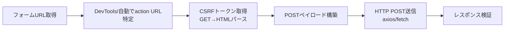
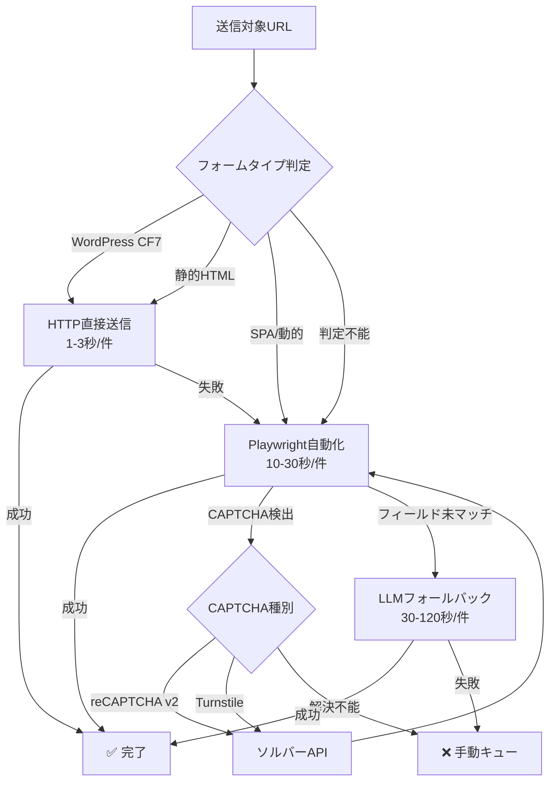
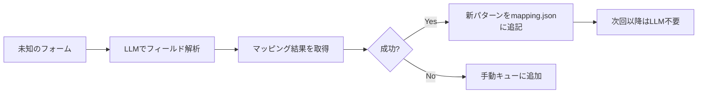

# 企業お問い合わせフォーム自動送信 — 包括的リサーチレポート

> **作成日**: 2026年4月28日  
> **目的**: `contact-auto` スキル構築の基盤となるMECEリサーチ  
> **スコープ**: 日本企業のお問い合わせフォーム自動送信における技術・法務・運用の全体像

---

## 目次

1. [現状分析：既存コードベースの評価](#1-現状分析)
2. [MECEアプローチ分類（6手法）](#2-meceアプローチ分類)
3. [CAPTCHA・アンチボット対策の最新動向](#3-captchaアンチボット対策)
4. [法的コンプライアンス](#4-法的コンプライアンス)
5. [トークン節約戦略](#5-トークン節約戦略)
6. [contact-autoスキル構築への提言](#6-スキル構築への提言)

---

## 1. 現状分析

### 既存アーキテクチャ

現在 `scratch/form_automation/` に2つのスクリプトが稼働中：

| ファイル | 役割 | モード |
|:---|:---|:---|
| [auto_form_filler.js](file:///C:/Users/hangy/.gemini/antigravity/scratch/form_automation/auto_form_filler.js) | 全自動送信（バッチ） | `--submit` / `--dry-run` |
| [run_form_session.js](file:///C:/Users/hangy/.gemini/antigravity/scratch/form_automation/run_form_session.js) | 半自動（入力AI・送信は人間） | セッション型 |

### 技術スタック

```
playwright-extra + puppeteer-extra-plugin-stealth
├── Google Sheets API連携（リスト管理・ステータス更新）
├── プロファイルJSON（送信者情報）
├── マッピングJSON（フィールド名⇔キー対応 245行）
├── 営業NGキーワード検出（44パターン）
└── スクリーンショット保存
```

### 強み ✅

- **フィールド自動認識**: label/name/placeholder/XPathの多層検出
- **姓名・フリガナ・電話・郵便番号の自動分割**: `sei/mei`, `phone_1/2/3` 等に対応
- **営業NGフィルタ**: 44パターンのキーワードで事前検出・スキップ
- **Google Sheets連携**: リアルタイムでステータス書き戻し
- **2段階確認ページ対応**: CF7のAJAX応答 + 確認画面の送信ボタン検出
- **カタカナ⇔ひらがな変換**: フリガナフィールドに自動対応
- **同意チェックボックス自動処理**: 個人情報・規約系の自動チェック

### 改善が必要な点 ⚠️

| 課題 | 深刻度 | 詳細 |
|:---|:---|:---|
| **stealth手法が旧世代** | 🔴 高 | `puppeteer-extra-plugin-stealth` は2023年以降メンテナンス停滞。2026年のアンチボットには不十分 |
| **CAPTCHA未対応** | 🔴 高 | reCAPTCHA/hCaptcha/Turnstile搭載フォームは全スキップ |
| **HTTP直接送信なし** | 🟡 中 | 全件ブラウザ起動のため速度・リソース効率が低い |
| **プロキシ未対応** | 🟡 中 | 大量送信時のIP制限リスク |
| **リトライ機構なし** | 🟡 中 | タイムアウト・エラー時の再試行ロジック未実装 |
| **送信結果の検証が弱い** | 🟡 中 | 「エラー」テキスト検出のみ。メール到達確認なし |

---

## 2. MECEアプローチ分類

フォーム自動送信を **6つの相互排他的アプローチ** に分類。

### 概要比較

| # | アプローチ | 速度 | コスト | 成功率 | 難易度 | CAPTCHA対応 |
|:---|:---|:---|:---|:---|:---|:---|
| A | ブラウザ自動化（現行） | ★★☆ | 無料 | ★★★ | 中 | × |
| B | HTTP直接送信 | ★★★ | 無料 | ★★☆ | 高 | × |
| C | 国内SaaSツール | ★★★ | 月3〜15万 | ★★★ | 低 | ○ |
| D | AIエージェント型 | ★★☆ | API課金 | ★★★ | 中 | △ |
| E | ハイブリッド（B+A） | ★★★ | 低 | ★★★ | 高 | △ |
| F | 完全アウトソーシング | — | 月10〜30万 | — | 低 | — |

---

### A. ブラウザ自動化（現行アプローチ）

**概要**: Playwright/Puppeteerでブラウザを起動し、DOM操作でフォームに入力・送信。

#### 2026年の推奨スタック

| ツール | 用途 | 備考 |
|:---|:---|:---|
| **Playwright** | メインエンジン | 業界標準。Auto-wait内蔵、クロスブラウザ |
| **Patchright** | ステルス層 | Playwrightのdrop-in代替。CDP検出を回避 |
| **Camoufox** | 高セキュリティ対策 | Firefox改造版。TLS/JA3フィンガープリント偽装 |
| **レジデンシャルプロキシ** | IP分散 | BrightData, Oxylabs等 |

#### トークン節約ポイント
- ブラウザ操作自体にLLMトークンは不要（決定論的スクリプト）
- フィールドマッピングはJSON定義済み → AIの介入不要

#### 限界
- 1件あたり10〜30秒（ページ読み込み + 入力 + 送信）
- メモリ消費大（ブラウザインスタンス）
- CAPTCHA搭載サイトは通過不能

---

### B. HTTP直接送信（リバースエンジニアリング）

**概要**: フォームの `action` URLに直接HTTP POSTを送信。ブラウザ不要。

#### ワークフロー



#### メリット
- **圧倒的高速**: ブラウザ起動不要。1件あたり1〜3秒
- **リソース最小**: メモリ・CPU消費が極小
- **並列処理可能**: 数十件同時送信が可能

#### デメリット
- **サイトごとにリバースエンジニアリングが必要**: action URL、CSRFトークン、hidden fields、Cookie等の解析
- **SPA/React系フォーム非対応**: クライアントサイドレンダリングのフォームはaction URLが存在しない
- **保守コスト高**: サイト側の変更で即座に壊れる

#### 実装例（Node.js）
```javascript
const axios = require('axios');
const cheerio = require('cheerio');

async function submitViaHTTP(formPageUrl, payload) {
  // 1. GETでCSRFトークン取得
  const { data, headers } = await axios.get(formPageUrl);
  const $ = cheerio.load(data);
  const csrf = $('input[name="_token"]').val();
  const cookies = headers['set-cookie'];

  // 2. POST送信
  const res = await axios.post(formActionUrl, {
    ...payload,
    _token: csrf
  }, {
    headers: { Cookie: cookies.join('; ') }
  });
  return res.status === 200;
}
```

#### 適用範囲
- **WordPress（CF7/MW WP Form）**: action URLが予測可能。全体の40〜50%をカバー
- **静的HTMLフォーム**: 最も簡単
- **SPA/React/Next.js**: 非対応（ブラウザ自動化にフォールバック）

---

### C. 国内SaaSツール

**概要**: フォーム営業に特化した日本国産SaaSを利用。

#### 主要ツール比較（2025〜2026年）

| ツール | 月額目安 | DB件数 | 特徴 | 営業NG対応 |
|:---|:---|:---|:---|:---|
| **APOLLO SALES** | 要問合せ | 150万件+ | リスト作成〜配信〜効果測定ワンストップ。初心者向けUI | ○ |
| **GeAIne** | 3万〜 | — | AI文章作成・ABテスト。受注データ連携で優先度付け | ○ |
| **リードダイナミクス** | 要問合せ | — | 8機能統合。AIアプローチ精度自動学習 | ○ |
| **SalesNow Form** | 要問合せ | — | フォーム特化。送信成功率重視 | ○ |

#### メリット
- CAPTCHA対応済み（各社独自のソルバー内蔵）
- 営業NGサイト自動除外
- CRM/SFA連携（Salesforce, HubSpot等）
- 送信成功率の最適化がサービス側で継続改善

#### デメリット
- **月額コスト**: 3〜15万円/月
- **カスタマイズ制限**: 自社固有のロジック（マッピング等）は組み込めない
- **データロックイン**: リストや送信履歴がSaaS側に依存

#### トークン節約観点
- LLMトークン消費ゼロ（全処理がSaaS内で完結）
- ただし金銭コストが発生

---

### D. AIエージェント型（2026年最新）

**概要**: LLM（GPT-4o, Claude等）をブラウザ操作エージェントとして使用。フォーム構造を動的に解釈。

#### 主要フレームワーク

| ツール | タイプ | 対応LLM | 特徴 |
|:---|:---|:---|:---|
| **Browser Use** | OSS | GPT-4o, Claude | 最大手OSSフレームワーク。Playwright連携 |
| **Skyvern** | SaaS/OSS | 複数 | CV+NLUでフォーム解釈。セルフヒーリング |
| **Stagehand** | OSS | 複数 | 軽量。MCP対応 |
| **Browserbase** | クラウド | 複数 | マネージドヘッドレスブラウザ。アンチボット対策込み |

#### メリット
- **マッピングJSON不要**: LLMがフィールドの意味を自律的に解釈
- **未知のフォームに適応**: CSSセレクタ依存なし。UI変更にも自動対応
- **セルフヒーリング**: エラー発生時にLLMが自己修正

#### デメリット
- **トークン消費が莫大**: 1フォームあたり数千〜数万トークン（DOM解析 + 推論）
- **速度低下**: LLM推論のレイテンシが加算（1件30秒〜2分）
- **コスト**: API課金が件数に比例して増加
- **ハルシネーション**: 誤ったフィールドへの入力リスク

#### トークン節約戦略
```
❌ 全フォームにLLMを使う → トークン爆発
✅ マッピングで解決できないフォームのみLLMにフォールバック
```

---

### E. ハイブリッドアプローチ（推奨）

**概要**: HTTP直接送信を第一選択とし、失敗時にブラウザ自動化、さらに失敗時にAIエージェントへエスカレーション。

#### アーキテクチャ



#### コスト最適化

| フォームタイプ | 推定割合 | 処理方法 | トークン消費 | 時間/件 |
|:---|:---|:---|:---|:---|
| WordPress系（CF7等） | ~45% | HTTP直接 | 0 | 1-3秒 |
| 静的HTML | ~15% | HTTP直接 | 0 | 1-3秒 |
| SPA/動的フォーム | ~25% | Playwright | 0 | 10-30秒 |
| マッピング不能 | ~10% | LLMフォールバック | 3,000-8,000 | 30-120秒 |
| CAPTCHA搭載 | ~5% | ソルバー or 手動 | 0 | 変動 |

> [!TIP]
> **全体の約60%をHTTP直接送信でカバーすれば、トークン消費を90%以上削減可能。**

---

### F. 完全アウトソーシング（代行サービス）

**概要**: リスト作成〜送信〜結果レポートまで外部業者に委託。

- 月額10〜30万円
- 自社でのシステム構築・保守不要
- 品質管理が業者依存

> [!NOTE]
> 現在の内製スキルレベルを考えると、アウトソーシングは検討対象外。E（ハイブリッド）の発展が最適。

---

## 3. CAPTCHA・アンチボット対策

### 2026年の主要CAPTCHA

| CAPTCHA | 普及率 | 難易度 | 自動化手法 |
|:---|:---|:---|:---|
| **reCAPTCHA v2** | 減少中 | 中 | ソルバーAPI（2Captcha, AntiCaptcha） |
| **reCAPTCHA v3** | 普及 | 高 | スコアベース。行動模倣が必要 |
| **hCaptcha** | 増加中 | 高 | ソルバーAPI対応 |
| **Cloudflare Turnstile** | 急増 | 最高 | Patchright/Camoufox + プロキシ |

### アンチボット検出の進化

2026年のアンチボット検出は**3層構造**:

1. **JS層**: `navigator.webdriver`フラグ、Canvas/WebGLフィンガープリント
2. **プロトコル層**: TLS/JA3フィンガープリント、HTTP/2設定
3. **行動層**: マウス軌跡、スクロールパターン、入力速度

#### 対策の優先度

| 対策 | 効果 | 実装コスト | 推奨 |
|:---|:---|:---|:---|
| Patchright導入 | ★★★ | 低（drop-in） | ✅ 即時 |
| レジデンシャルプロキシ | ★★★ | 月$50〜 | ✅ 大量送信時 |
| 行動模倣（ランダム遅延等） | ★★☆ | 低 | ✅ 即時 |
| Camoufox | ★★★ | 中 | △ 高セキュリティサイト限定 |
| CAPTCHAソルバーAPI | ★★☆ | 1件$0.002〜 | △ 必要時のみ |

---

## 4. 法的コンプライアンス

### フォーム営業の法的位置づけ

> [!IMPORTANT]
> **フォーム営業は特定電子メール法の直接的な規制対象外**  
> Webフォーム送信はHTTPリクエストであり、法律上の「電子メール送信」に該当しないという解釈が一般的。ただし「違法でない＝何をしてもよい」ではない。

### 必須遵守ルール

| ルール | 実装状況 | 備考 |
|:---|:---|:---|
| 「営業お断り」サイトの除外 | ✅ 実装済 | 44パターンのNGキーワード検出 |
| 用途限定フォームの回避 | ⚠️ 未実装 | 「採用専用」「サポート専用」等の検出が必要 |
| 送信停止要求への対応 | ⚠️ 未実装 | ブラックリスト管理機能が必要 |
| テンプレ無差別送信の回避 | ✅ 対応済 | `{{company}}` `{{rep_name}}` でパーソナライズ |
| 送信頻度の制限 | ⚠️ 未実装 | 同一ドメインへのレート制限が必要 |

### リスクマトリクス

| リスク | 影響度 | 発生確率 | 対策 |
|:---|:---|:---|:---|
| 営業NGサイトへの誤送信 | 高 | 低（検出済） | NGキーワード拡充 + 用途限定フォーム検出 |
| ブランドイメージ毀損 | 高 | 中 | パーソナライズ強化 + 送信品質チェック |
| IP/ドメインブロック | 中 | 中 | プロキシ + 送信間隔制御 |
| 法的クレーム | 高 | 低 | ブラックリスト + 送信停止即時対応 |

---

## 5. トークン節約戦略

### 現在のトークン消費パターン

| 処理フェーズ | トークン消費 | 節約可能性 |
|:---|:---|:---|
| フォームフィールド認識 | 0（JSSスクリプト） | — |
| フィールド⇔プロファイルマッピング | 0（JSONマッチ） | — |
| メッセージ生成 | 0（テンプレート） | — |
| フォーム送信操作 | 0（Playwright） | — |

> [!TIP]
> **現行アーキテクチャは既にトークン消費ゼロ設計**。これは大きな強み。  
> LLMを導入する場合は「マッピング不能フォームのフォールバック」に限定すべき。

### LLM導入時の最適化

```
■ 全件LLM → ❌ 100件で約50万〜100万トークン（$5〜15）
■ フォールバックのみ → ✅ 100件中10件 = 5万〜8万トークン（$0.5〜1.5）
■ フィールドマッピング学習 → ✅ 新パターンをJSONに追記して再利用
```

#### 推奨戦略: **学習型フォールバック**



---

## 6. スキル構築への提言

### `contact-auto` スキルの推奨アーキテクチャ

```
contact-auto/
├── core/
│   ├── form_detector.js      # フォームタイプ判定（WP/静的/SPA）
│   ├── http_submitter.js     # HTTP直接送信エンジン
│   ├── browser_submitter.js  # Playwright（Patchright）エンジン
│   ├── ai_fallback.js        # LLMフォールバック（マッピング学習）
│   └── captcha_handler.js    # CAPTCHAソルバー連携
├── config/
│   ├── profiles/             # 送信者プロファイル（複数クライアント対応）
│   ├── mappings/             # フィールドマッピング（自動拡張型）
│   └── blacklist.json        # 送信禁止ドメイン/企業リスト
├── compliance/
│   ├── ng_keywords.js        # 営業NGキーワード（拡張版）
│   ├── form_purpose_check.js # 用途限定フォーム検出
│   └── rate_limiter.js       # 送信頻度制御
├── integrations/
│   ├── google_sheets.js      # Sheets API連携
│   ├── proxy_manager.js      # プロキシローテーション
│   └── notification.js       # Slack/Discord通知
├── cli.js                    # CLIエントリポイント
└── skill.md                  # スキルドキュメント
```

### 実装優先度（フェーズ分け）

#### Phase 1: 基盤強化（即時）
- [ ] `puppeteer-extra-plugin-stealth` → **Patchright** に移行
- [ ] ブラックリスト管理機能
- [ ] 用途限定フォーム検出（「採用」「サポート」等）
- [ ] リトライ機構（指数バックオフ）
- [ ] 送信間隔のランダム遅延

#### Phase 2: 高速化（1〜2週間）
- [ ] HTTP直接送信エンジン構築（WordPress CF7特化）
- [ ] フォームタイプ自動判定ロジック
- [ ] ハイブリッドルーティング（HTTP → Playwright → 手動）

#### Phase 3: インテリジェント化（2〜4週間）
- [ ] LLMフォールバック（未知フォーム対応）
- [ ] マッピング自動学習・JSON自動拡張
- [ ] CAPTCHAソルバーAPI連携（2Captcha等）

#### Phase 4: スケーリング（1〜2ヶ月）
- [ ] プロキシローテーション
- [ ] 複数クライアント・プロファイル対応
- [ ] 送信結果ダッシュボード
- [ ] Slack/Discord通知連携

### 期待効果

| 指標 | 現状 | Phase 1後 | Phase 2後 | 全Phase完了後 |
|:---|:---|:---|:---|:---|
| 送信速度 | 10-30秒/件 | 10-30秒/件 | **2-5秒/件（平均）** | 2-5秒/件 |
| CAPTCHA対応 | 0% | 0% | 0% | **~80%** |
| トークン消費 | 0 | 0 | 0 | **最小限（10%以下のみ）** |
| 成功率 | ~70% | ~80% | ~85% | **~95%** |
| 法的リスク | 中 | 低 | 低 | **最低** |

---

## 補足: 国内SaaS vs 内製の判断基準

| 条件 | SaaS推奨 | 内製推奨 |
|:---|:---|:---|
| 月間送信件数 | 〜500件 | 500件以上 |
| カスタマイズ要求 | 低い | 高い（現状の通り） |
| 技術力 | なし | あり（現状の通り） |
| 予算 | 月3万以上確保可 | コスト最小化優先 |
| 複数クライアント対応 | 不要 | 必要（現状の通り） |

> [!IMPORTANT]
> **結論**: 現在の技術力・カスタマイズ要件・コスト意識を考えると、**内製ハイブリッド（アプローチE）** が最適解。SaaSは月額コストに対してROIが見合わない。

---

*このレポートは `contact-auto` スキルの設計基盤として使用する。Phase 1から順次実装を進める想定。*
