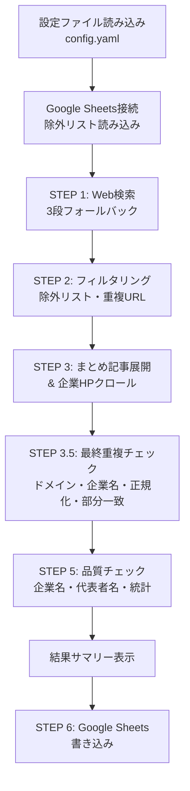
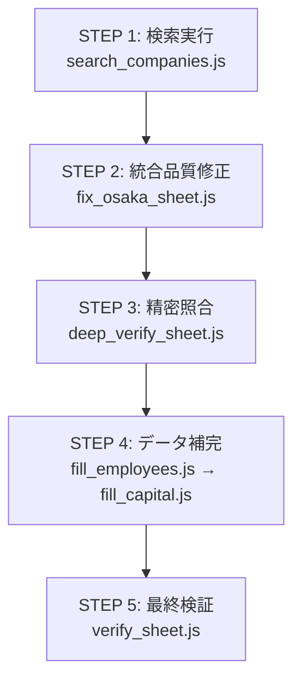

# Company Search スキル

Web検索から企業情報を自動収集し、Google Sheetsに営業リストとして書き込むCLIツール。
キーワード×地域で検索 → 企業HPをクロールして詳細情報抽出 → フィルタリング → Sheets書き込みを一気通貫で実行する。

## プロジェクト構成

```
company_search/
├── search_companies.js      # メインオーケストレーター（エントリーポイント）
├── searcher.js              # Web検索モジュール（3段構成）
├── crawler.js               # 企業HPクローラー（情報抽出）
├── sheets_writer.js         # Google Sheets書き込みモジュール
├── run_batch.js             # バッチ実行（複数キーワード連続検索）
├── config.yaml              # 設定ファイル
├── package.json             # 依存関係定義
├── google_credentials.json  # Google APIサービスアカウント認証（※gitignore対象）
│
│   ─── 品質管理ユーティリティ ───
├── fix_osaka_sheet.js       # 統合品質修正（3重チェック体制）
├── verify_sheet.js          # 全件バリデーション＆詳細ダンプ
├── deep_verify_sheet.js     # Playwright精密照合（URL-企業名一致）
│
│   ─── データ補完 ───
├── fill_employees.js        # 外部ソースで従業員数を補完
├── fill_capital.js          # 企業HPから資本金をクロール取得
│
│   ─── フィルタリング ───
├── remove_listed.js         # 上場企業の一括削除
├── remove_invalid.js        # フォームなし/間借りドメインの削除
│
│   ─── データ修正 ───
├── fix_capital_final.js     # 資本金バリデーション＆修正
├── fix_capital.js           # 資本金初期修正
├── fix_header.js            # シート列追加（資本金列挿入等）
└── fix_one.js               # 個別行の手動修正
```

## 依存パッケージ

- `playwright` + `playwright-extra` + `puppeteer-extra-plugin-stealth` — ステルスブラウザ自動操作
- `googleapis` — Google Sheets API / Custom Search API
- `js-yaml` — YAML設定ファイルパーサー

## 処理フロー



### 詳細ステップ

1. **設定読み込み** — `config.yaml`からキーワード・地域・フィルタ条件・出力先を取得
2. **Sheets接続** — サービスアカウントでGoogle Sheets APIに接続、除外リスト＆既存URLを読み込み
3. **Web検索**（3段フォールバック）
   - Google Custom Search API → DuckDuckGo → Google直接検索
4. **フィルタリング** — 除外リストのドメイン/企業名照合、既存URL重複チェック
5. **まとめ記事展開 & クロール**
   - まとめ記事（`N選`, `おすすめ`, 比較記事等）を検出 → 記事内の企業リンクを抽出
   - 各企業HPをクロールし、企業名・従業員数・代表者名・フォームURL・キーワードHITを抽出
   - ポータルサイト（mynavi, doda等）の場合は公式HPを再検索
6. **最終重複チェック（強化版）** — ドメイン（サブドメイン除去）+ 企業名（全角半角正規化・小文字化・部分一致）の多段チェック
7. **品質チェック（必須報告）** — 企業名・代表者名の最終バリデーション、従業員数・フォーム・キーワードHITの統計出力
8. **Sheets書き込み** — テンプレートシートをコピーして追記

## 検索モジュール (`searcher.js`)

### 3段フォールバック構成

| 優先 | エンジン | 方式 | 特徴 |
|------|---------|------|------|
| 1 | Google CSE API | REST API | 安定・高速。日次100件まで無料枠 |
| 2 | DuckDuckGo | HTMLスクレイピング | CAPTCHA少。「もっと見る」ボタンで追加取得 |
| 3 | Google Direct | 人間速度スクレイピング | 最終手段。headful + 人間速度入力 |

### 除外ドメイン

求人サイト・SNS・EC・政府サイト等、約60ドメインをハードコード除外。

### 検索クエリ構成

```
{keywords} {region} 会社
```

例: `ローカルSEO 大阪 会社`

## クローラー (`crawler.js`)

### 抽出情報

| 項目 | 抽出方法 | フォールバック |
|------|---------|--------------|
| 企業名 | 会社概要title → 本文ラベル → OGP → title → 本文先頭 | 5段階フォールバック |
| 従業員数 | 正規表現10パターン + 全角数字自動変換（`従業員数`, `社員数`, `スタッフ数`, `正社員`等） | `null`（不明） |
| 代表者名 | 正規表現11パターン（スペース付きフルネーム優先、社長/直結パターン含む） | `ご担当者` |
| 資本金 | 正規表現2パターン + インラインバリデーション（下記参照） | 空 |
| フォームURL | リンクテキスト/URL正規表現マッチ | 空文字 |
| キーワードHIT | HP本文にconfig指定キーワードが含まれるか | `false` |

### 資本金バリデーション（インライン）

`crawler.js`内で資本金抽出時に即バリデーション:
- 数字 + `万円`/`億円`/`円` → 合格
- 円表記なしの純数字6桁以上 → `{数字}円`として採用
- それ以外の文字列（文章片・JSON断片・メールアドレス等） → 不正データとして無視

`isValidCapital`（`fix_capital_final.js`で定義）の合格条件:
- `^[\d,]+\s*(万円|億円|円|万|億)$` — 数字+単位
- `^[\d,]+$` で6桁以上 — 純数字
- `^非(公開|開示)$` — 非公開表記

### 上場企業判定 (`isListedCorporation`)

`crawler.js`からエクスポートされる関数。テキスト中に以下14キーワードのいずれかが含まれれば上場企業と判定:

`東証プライム`, `東証スタンダード`, `東証グロース`, `東証一部`, `東証二部`, `JASDAQ`, `マザーズ`, `上場企業`, `証券コード`, `株式上場`, `IPO`, `東京証券取引所`, `名古屋証券取引所`, `札幌証券取引所`, `福岡証券取引所`

### 従業員数・資本金の外部ソースリサーチ（v1.3.1）

> [!IMPORTANT]
> 企業サイトだけでは従業員数の取得率が低い（10%程度）。外部ソースを併用して取得率を改善する。

**4段階フォールバック:**

| 優先 | ソース | URL | 取得情報 | 所要時間 |
|------|--------|-----|---------|---------|
| 1 | 求人ボックス | `https://求人ボックス.com` | 従業員数・資本金・設立年 | 30秒 |
| 2 | Wantedly | `https://www.wantedly.com` | 登録メンバー数・事業内容 | 30秒 |
| 3 | Google検索 | `{会社名} 従業員数` | PR・業界紙・会社概要 | 1分 |
| 4 | 登記情報（手動） | `touki-kyoutaku-online.moj.go.jp` | 役員数（補助指標） | 1分 |

**判定基準:**
- 従業員数が明記 → そのまま採用
- Wantedlyの登録メンバー数 → 「社員数」とイコールではない。参考値として扱う
- 登記の取締役3名以下 → 小規模の強いサインだが、確定ではない
- 情報が取得できない場合 → 「不明」。推測で断定しない

### まとめ記事判定

URLパターン（`/column/`, `/blog/`, `/ranking/`等）とタイトルパターン（`N選`, `おすすめ`, `比較`等）で自動判定。

### ポータルサイト再検索

mynavi, doda, prtimes等のポータルドメインを検出すると、企業名で公式HPをDuckDuckGo再検索し、公式HPをクロールし直す。

### 企業名バリデーション（v1.2.0 強化）

- 正規表現からひらがな除外（助詞混入防止）→ カタカナ・漢字・英数字のみマッチ
- `CORP_NAME_NOISE_PATTERNS`による文章片チェック（15パターン）
- `isValidCompanyName`に50+除外パターン
- 先頭長音符「ー」チェック（切れた企業名の検出）
- 助詞チェックしきい値6文字、末尾助詞チェック、ひらがな末尾チェック
- フリガナ除去（英数字直後の4文字以上カタカナ連続を除去）

### 代表者名バリデーション（v1.3.1）

> [!CAUTION]
> NGリスト方式は使用禁止。「人名であるかを正で判定」する。
> 代表者名は必ず`cleanRepresentativeName`でゴミ除去してから`isJapanesePersonName`で判定すること。

**処理フロー:**
1. `cleanRepresentativeName(raw)` — 名前の後ろに付くゴミ（取締役/執行役員/から皆様/事業内容等）を除去
2. `isJapanesePersonName(cleaned)` — クリーン済みの文字列が人名かを正で判定

**`isJapanesePersonName` 合格条件:**
- 漢字姓(1-4文字) + スペース + 漢字名(1-4文字)
- 漢字のみ3-8文字
- ひらがな姓名（まれだが実在）

**即却下条件:**
- カタカナ2文字以上を含む
- 英数字・記号を含む
- 「士」「師」「長」「員」「役」「官」「者」で終わる
- 助詞を含む（から/より/まで/への/との/皆様/です/ます）

### 品質チェックステップ（v1.3.2 3重チェック+データバリデーション+上場除外）

> [!CAUTION]
> 品質チェックは**必ず実施**し、結果を**必ず報告**する。省略禁止。
> **上場企業は絶対除外。例外なし。**

Sheets書き込み前に全レコードに対して実行:

1. **企業名バリデーション** — `isValidCompanyName`で再チェック
2. **URL-企業名整合性** — 第三者サイト（求人、PR等）なら即削除
3. **間借りドメイン除外** — `hp.xxx.co.jp`など制作会社のサブドメイン借用や明らかな別企業ドメインを不一致として削除
4. **大手・上場企業除外** — ターゲット外大手、および上場キーワード検出で絶対除外
5. **代表者名** — `cleanRepresentativeName` → `isJapanesePersonName`の2段階
6. **問合せフォーム必須・妥当性** — フォームURLがない企業は「営業目的で無意味」として絶対削除。LINE等のSNSリンクも除外
7. **資本金バリデーション** — `isValidCapital`: 数字+万円/億円/円のみ許容
8. **【必須・精密照合】企業名・URL完全一致チェック** — Playwrightで抽出先URLのルートにアクセスし、`<title>` または `<footer>` (Copyright) のテキストに「抽出した企業名」が含まれていない場合は**「提携会社・事例の誤抽出」として絶対削除**。
9. **品質統計の出力** — 全項目の統計 + 残存問題数
10. **「✅ 品質チェック完了」の明示出力** — チェック実施の証跡

## Google Sheets連携 (`sheets_writer.js`)

### 認証

`google_credentials.json`（サービスアカウント）を使用。同ディレクトリ → `form_automation/`の順に検索。

### シート構造

| 列 | 内容 |
|----|------|
| A | № |
| B | エリア |
| C | 企業名 |
| D | 代表者名 |
| E | URL |
| F | 問い合わせフォームURL |
| G | 送信日 |
| H | 送信○× |
| I | 送信不可理由 |
| J | 従業員数 |
| K | 資本金 |
| L | キーワードHIT |
| M | HIT詳細 |
| N | 取得日時 |

### テンプレートシート方式

- `list-format` テンプレートシートをコピーして新規シート作成（列幅・書式・ドロップダウン・条件付き書式を引き継ぎ）
- テンプレートがない場合はフォールバックで空シート + ヘッダー書き込み

### 除外リスト

別シートに企業名（B列）とURL（D列）を管理。検索時に自動照合して除外。

## 設定ファイル (`config.yaml`)

```yaml
search:
  keywords:          # 検索キーワード（配列）
    - ローカルSEO
  region: 大阪       # 検索地域
  max_results: 50    # 最大取得件数

filters:
  max_employees: 20  # 従業員数上限（超過する企業はスキップ）
  hp_check_keywords: # HIT判定キーワード（HP本文内検索）
    - マーケティング
    - SEO
    - 広告運用

exclude:
  spreadsheet_id: xxx  # 除外リストのスプレッドシートID
  sheet_name: 除外リスト

output:
  spreadsheet_id: xxx  # 出力先スプレッドシートID
  sheet_name: Webマーケティング_大阪

google_cse:
  enabled: false     # Google CSE APIの有効/無効
  api_key: xxx       # APIキー
  cx: xxx            # カスタム検索エンジンID

speed:
  page_wait_min: 2000      # ページ読み込み後の最小待機(ms)
  page_wait_max: 5000      # ページ読み込み後の最大待機(ms)
  crawl_interval_min: 3000 # クロール間隔の最小待機(ms)
  crawl_interval_max: 8000 # クロール間隔の最大待機(ms)
```

## コマンドライン

```bash
# 通常実行（本番）
node search_companies.js

# ドライラン（Sheets書き込みなし）
node search_companies.js --dry-run

# カスタム設定ファイル
node search_companies.js --config custom.yaml

# テスト（ドライラン + 最大5件）
node search_companies.js --dry-run --max 5

# クロールなしで検索のみ
node search_companies.js --skip-crawl
```

## 品質管理ユーティリティ

検索・書き込み後の**運用フェーズ**で使用するツール群。すべてスタンドアロンで実行可能。

### 統合品質修正 (`fix_osaka_sheet.js`)

3重チェック体制による自動修正ツール（v1.3.0）:

| チェック層 | 内容 | アクション |
|-----------|------|----------|
| 企業名バリデーション | `isValidCompanyName`で再チェック | 無効→削除 |
| URL-企業名整合性 | 第三者サイト（求人・PR・比較等）検出 | 不一致→削除 |
| 大手企業除外 | KDDI/GMO/サイバーエージェント等 | 大手→削除 |
| 間借りドメイン除外 | `hp.xxx.co.jp`等 | 乖離→削除 |
| ドメイン重複 | 正規化済みドメインの完全一致 | 重複→削除 |
| 企業名重複 | 全角半角正規化+部分一致 | 重複→削除 |
| 代表者名クリーニング | `cleanRepresentativeName`→`isJapanesePersonName` | ゴミ除去/ご担当者化 |
| フォームURL必須 | フォームなし=営業不可 | なし→削除 |
| フォーム妥当性 | LINE/SNSリンク除外 | 不正→削除 |

```bash
node fix_osaka_sheet.js
```

### 全件検証 (`verify_sheet.js`)

全レコードを1件ずつ10パターンで目視レベル検証し、問題箇所を列挙:
- 企業名バリデーション + 要注意パターン検出（句読点/長すぎ/URL混入/年号等）
- ドメイン重複 + 企業名部分一致重複
- 代表者名異常検出

```bash
node verify_sheet.js
```

### 精密照合 (`deep_verify_sheet.js`)

Playwrightで全企業URLのトップページに実アクセスし、`<title>` / OGP / `<footer>`（Copyright）に企業名が含まれるか照合。含まれない場合は「提携先・事例の誤抽出」として自動削除。

```bash
node deep_verify_sheet.js
```

### 従業員数補完 (`fill_employees.js`)

従業員数が「不明」の企業に対し、2段階フォールバックで外部取得:
1. **求人ボックス** — 求人詳細ページから従業員数パターンマッチ
2. **Google検索** — `{会社名} 従業員数 会社概要`で検索

上場キーワード検出時は除外対象としてマーク。

```bash
node fill_employees.js
```

### 資本金補完 (`fill_capital.js`)

資本金未取得の企業HPをクロールし、会社概要ページから資本金を正規表現で抽出。全角数字→半角変換対応。

```bash
node fill_capital.js
```

### 資本金修正 (`fix_capital_final.js`)

既存の資本金データをバリデーションし、不正データ（文章片/JSON断片等）を`cleanCapital`でクリーニングまたは空に修正。修正後に全件を再検証し残存問題数を出力。

```bash
node fix_capital_final.js
```

### 上場企業一括削除 (`remove_listed.js`)

`fill_employees.js`で検出された上場企業リストに基づき、シートから該当企業を部分一致で一括削除。

```bash
node remove_listed.js
```

### フォームなし/間借り削除 (`remove_invalid.js`)

フォームURLなしの企業 + 間借りドメイン（`hp.xxx.co.jp`等）の企業を一括削除。

```bash
node remove_invalid.js
```

## 運用ワークフロー

検索実行後の品質改善は以下の5ステップで実施:



| ステップ | ツール | 目的 | 所要時間目安 |
|---------|--------|------|----------|
| 1 | `search_companies.js` | 検索→クロール→シート書き込み | 5-15分 |
| 2 | `fix_osaka_sheet.js` | 3重チェックで無効データ削除・修正 | 1-2分 |
| 3 | `deep_verify_sheet.js` | URL-企業名の精密一致確認 | 5-10分 |
| 4 | `fill_employees.js` → `fill_capital.js` | 従業員数・資本金の外部取得 | 10-20分 |
| 5 | `verify_sheet.js` | 全件目視レベル検証で最終確認 | 1分 |

> [!TIP]
> STEP 2〜5は何度でも繰り返し実行可能。各ツールは冪等（すでに対応済みのデータはスキップ）。

## crawler.js エクスポート一覧

| 関数/定数 | 型 | 用途 |
|---------|------|------|
| `crawlCompanyWebsite` | function | メインクロール（企業情報一括抽出） |
| `extractCompanyLinksFromArticle` | function | まとめ記事内リンク収集 |
| `isArticlePage` | function | まとめ記事判定 |
| `isValidCompanyName` | function | 企業名バリデーション |
| `isListedCorporation` | function | 上場企業判定（14キーワード） |
| `isJapanesePersonName` | function | 日本人名正判定 |
| `cleanRepresentativeName` | function | 代表者名ゴミ除去 |
| `cleanCompanyName` | function | 企業名クリーニング |
| `employeeFilter` | function | 従業員数フィルタ |
| `EMPLOYEE_PATTERNS` | const | 従業員数抽出パターン（10個） |
| `REPRESENTATIVE_PATTERNS` | const | 代表者名抽出パターン（11個） |
| `CONTACT_PAGE_PATTERNS` | const | フォームURL検出パターン |
| `COMPANY_PAGE_PATTERNS` | const | 会社概要ページ検出パターン |

### npm scripts

```bash
npm run search       # node search_companies.js
npm run search:dry   # node search_companies.js --dry-run
npm test             # node search_companies.js --dry-run --max 5
```

## バッチ実行 (`run_batch.js`)

複数のキーワードセットで連続検索を実行する。`config.yaml` を書き換えながら `search_companies.js` を順次実行。

```javascript
const keywordLists = [
    ["MEO対策"],
    ["Googleビジネスプロフィール", "運用代行"],
    ["SEO", "MEO"],
    ["店舗集客"],
    ["ローカルSEO"]
];
```

```bash
node run_batch.js
```

## セットアップ

```bash
cd company_search
npm install

# Playwrightブラウザのインストール（初回のみ）
npx playwright install chromium
```

### 前提条件

- `google_credentials.json` が `company_search/` または `form_automation/` に配置されていること
- スプレッドシートがサービスアカウントのメールに共有されていること
- Google CSE APIを使う場合は `config.yaml` で `google_cse.enabled: true` に設定

## トラブルシューティング

### CAPTCHA検出

Google直接検索で `unusual traffic` が検出された場合、自動的に処理を中断する。
→ DuckDuckGoが使える状態であれば`google_cse.enabled: false`のままDDGを使用する。

### 企業名が正しく取得できない

5段階フォールバックで抽出するが、以下のケースで失敗しやすい:
- JavaScript SPAで動的レンダリングされる企業サイト
- 法人格（株式会社等）がサイト上に表示されていない
- タイトルタグやOGPが未設定

### Sheetsへの書き込みエラー

- サービスアカウントの認証情報が期限切れでないか確認
- スプレッドシートの共有設定を確認
- 日次APIクォータ（Sheets API: 300リクエスト/分）を超えていないか確認

### 文字化け対策 (PowerShell環境)

PowerShell上でスクリプトを実行してログファイルに出力する際（`> log.txt`等）、デフォルトエンコーディング（Shift-JISまたはUTF-16LE）の影響で文字化けが発生する場合があります。

**抜本的対策**:
1. **Node.jsのファイルシステム（fs）を使う**: 標準出力をリダイレクトするのではなく、スクリプト内で`fs.writeFileSync('log.txt', data, 'utf-8')`を使用して直接UTF-8で保存する。
2. **PowerShell側のエンコード設定**: コマンド実行前に文字コード規格をUTF-8（65001）に強制する。
   ```powershell
   chcp 65001 > $null; node script.js
   ```
   またはファイルにリダイレクトする際に文字コードを明示する:
   ```powershell
   node script.js 2>&1 | Out-File -Encoding utf8 log.txt
   ```
3. **継続的な設定**: PowerShellプロファイルに `$OutputEncoding = [console]::InputEncoding = [console]::OutputEncoding = New-Object System.Text.UTF8Encoding` を追加する。

---

## 変更履歴

| 日付 | バージョン | 変更内容 |
|------|-----------|---------|
| 2026-03-27 | 1.4.0 | スキル強化: 品質管理ユーティリティ12本を文書化、運用ワークフロー5ステップ定義、`crawler.js`エクスポート一覧追加、資本金バリデーション詳細・上場企業判定詳細を追記 |
| 2026-03-26 | 1.3.3 | Playwright精密照合(`deep_verify_sheet.js`)実装、提携先誤抽出の品質チェック項目8を定義 |
| 2026-03-26 | 1.3.2 | 上場企業絶対除外、フォームURL必須化、間借りドメイン除外を実装 |
| 2026-03-26 | 1.3.1 | 従業員数・資本金リサーチの外部拡張（4段階フォールバック）、`isValidCapital`バリデーション実装 |
| 2026-03-26 | 1.2.0 | 代表者名バリデーション強化: `isJapanesePersonName`正判定方式導入、`cleanRepresentativeName`2段階処理、企業名先頭「ー」チェック追加 |
| 2026-03-26 | 1.1.0 | 品質改善: 企業名抽出パターン強化、重複チェック正規化強化、品質チェックSTEP 5追加 |
| 2026-03-26 | 1.0.0 | 初版作成。`company_search` プロジェクトの全機能を文書化 |

> [!IMPORTANT]
> **更新ルール**: `company_search` プロジェクトのコードに変更があった場合は、このスキルファイルも合わせて更新してください。
> - YAML frontmatter の `version` と `last_synced` を更新
> - 変更履歴テーブルに新しいエントリを追加
> - 影響のあるセクションの記述を最新のコードに合わせて修正
